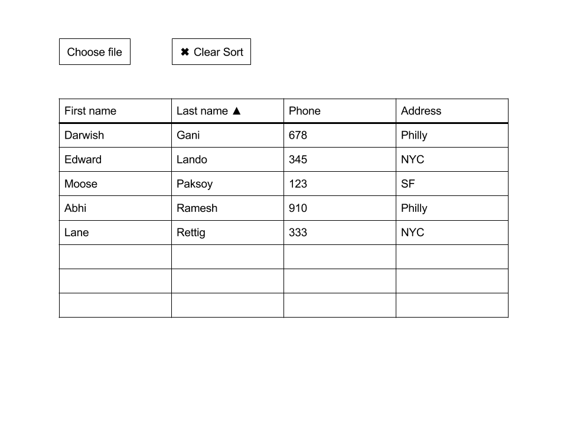
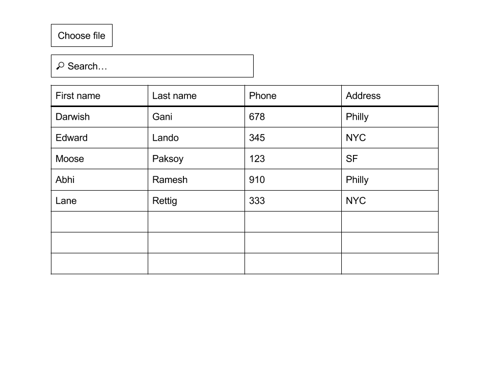
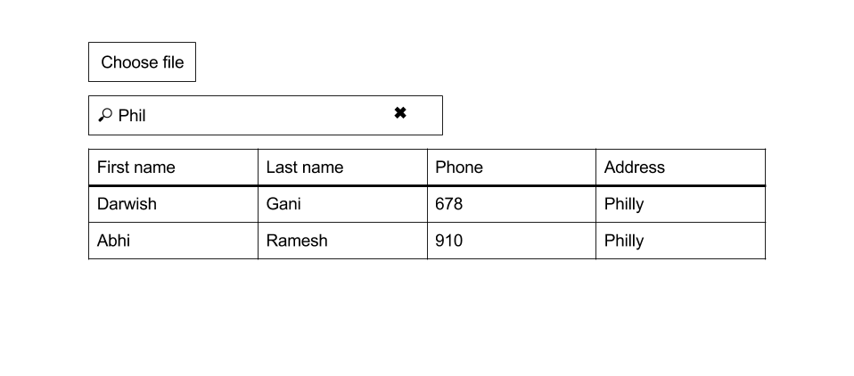

# Pair programming exercise: Reactive table

## Goal

The goal of this exercise is to display tabular data interactively using React.

### Sample output

#### CSV data

```csv
First name,Last name,Phone,Address
Moose,Paksoy,123,SF
Edward,Lando,345,NYC
Darwish,Gani,678,Philly
Abhi,Ramesh,910,Philly
Lane,Rettig,333,NYC
```

#### Page layout


#### Page layout (sorted)



#### Page layout (Search)

With no query:



With query:



### User interaction flow

1. User clicks the file picker and chooses a CSV file
1. (Optional) If the provided file is not a CSV file, page displays error.
1. Page reads the contents of the file via JavaScript and parses it using the
   `csv-parse` npm package
1. Page displays and HTML table representing the contents of the CSV file.
   Use the first line of the file as column headings
1. User clicks column heading to sort table by contents of that column
1. User clicks the column heading again to reverse the direction of the
   sort
1. User clicks "Clear Sort" button to revert the data to it's original format
1. User types in the "Search" box, which filters down table contents
   using simple string matching with `string.indexOf(query) > -1`
1.

## Instructions

For this exercise you will have a single React component that renders the
whole page. Tomorrow we're going to learn how to split React applications
into components that talk to each other. We don't need that today.

### Step 0: Running your app

Start your app with `npm start` and visit
[localhost:3000](http://localhost:3000/) to view it.

Your app comes preconfigured `webpack` hot module reloader so you don't
have to use nodemon to restart after making changes.

Your React code goes in `reactive-table/client/index.js` and your
HTML code goes in `index.html`.

Bootstrap has been included for you. You can add more CSS files in
`reactive-table/css`.

### Step 1: Read file data in JavaScript

Add a file picker to the page and `console.log()`  contents of any file
that the user selects.

Use the provided `FileInput` component to display a file picker on the page.
This component has an `onChange` event handler that is called with the contents
of the file after it has been read.

```jsx
function log(data) {
  console.log(data);
}

... Stuff left out here ...

<FileInput className="form-control" onChange={log} />
```

### Step 2: Parse CSV file data

1. Use the `csv-parse` library to parse the data from the user specified file
   into JavaScript arrays.

  ```javascript
  var parse = require('csv-parse');
  parse(data, {}, function(err, data) {
    if (err) {
      console.log('error parsing', err);
    } else {
      // data is an array of arrays
      console.log('data', data);
    }
  });
  ```
### Step 4: Display data in a table.

1. Create a react component using React.createClass({}) that displays a table with all the elements in the array.
  To do this, use the render(<table> // YOUR CODE HERE </table>) method to build your table out of the data.
1. Use getInitialState to initialize the table data arrays and parse the data from CSV.
1. Create headers for each row, using the first line of the CSV file as headers.
1. Display the rest of the data in the table body. One way to do this is to map the columns array into an array that contains
all the react elements that will be displayed
```
return columns.map(function(c, i) {
  return <td key={i}>{item[c]}</td>;
})
```
1. Remember that a table is an array of arrays. You have to map once for rows -> `<tr>` and once again on each row for cells `<td>`


### Step 5: Sort by column

We are going to build a simplified version of sorting.
1. Create a onClick event listener on the table headers.
1. This should call a function on the component that sorts information according to a specific column.
1. Clicking the column once should sort in ascending order. Clicking the column header again should toggle between 'asc' and 'dsc' order
1. Add a '▲' or '▼' character depending on how it is sorted.
1. Sort the data array according to the user's new preferences.

Note: Keep a copy of the data array somewhere else to restore when doing "Clean Sort"
1. Add a button that restores the initial order.
1. A copy of the original data would be a good way to do this, instead of reading and parsing the CSV again.
1. Clear all the filters if you have any.

BONUS: Instead of only having one column sorted at a time, create an object `sortDir` that
contains both the sorted column name and their directions so you can sort using more than one column at a time. For example:
```
sortDir: {FirstName: 'asc', LastName: 'dsc'}
```

### Step 6: Search

1. Create an object, string or array that holds your search queries in your component's state.
1. Create a form with a text input that receives the search query.
1. Add an onChange listener to the form that detects, stores and saves the query string to your component's state using `setState()`
1. Filter the elements that are displayed using indexOf() to check if the element contains the queried value.
HINT: Don't modify the data array, just filter the ones you display on render.

### Bonus step: Search by column

1. Using the same procedure as above, add an input on the headers of each column, below the title.
1. Use a filters array to store the values for each column and their queries.
1. Filter the elements being displayed.

Your filters array could look like this:
contains both the sorted column name and their directions so you can sort using more than one column at a time. For example:
```
filters: {FirstName: 'Moose', Number: '1'}
```
A good idea would be to use the same filters array for the column data as for step 6.
You can use the name "Global" for the main search bar

### Credits

Boilerplate code courtesy of
[React Hot Boilerplate](https://github.com/gaearon/react-hot-boilerplate)
