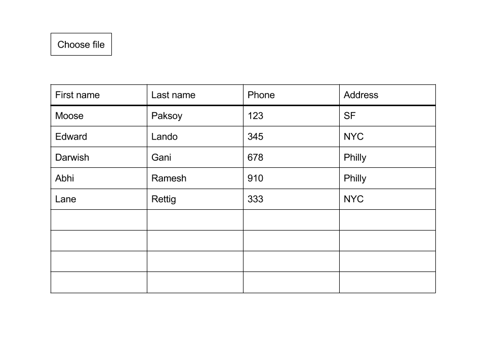

# Pair programming exercise: Reactive table

## Goal

The goal of this exercise is to display tabular data interactively using React.

## Instructions

For this exercise you will have a single React component that renders the
whole page. Tomorrow we're going to learn how to split React applications
into components that talk to each other. We don't need that today.

### The view

There should be a single file picker on the page.

Sample CSV file

```csv
First name,Last name,Phone,Address
Moose,Paksoy,123,SF
Edward,Lando,345,NYC
Darwish,Gani,678,Philly
Abhi,Ramesh,910,Philly
Lane,Rettig,333,NYC
```



### Credits

Boilerplate code courtesy of
[React Hot Boilerplate](https://github.com/gaearon/react-hot-boilerplate)
